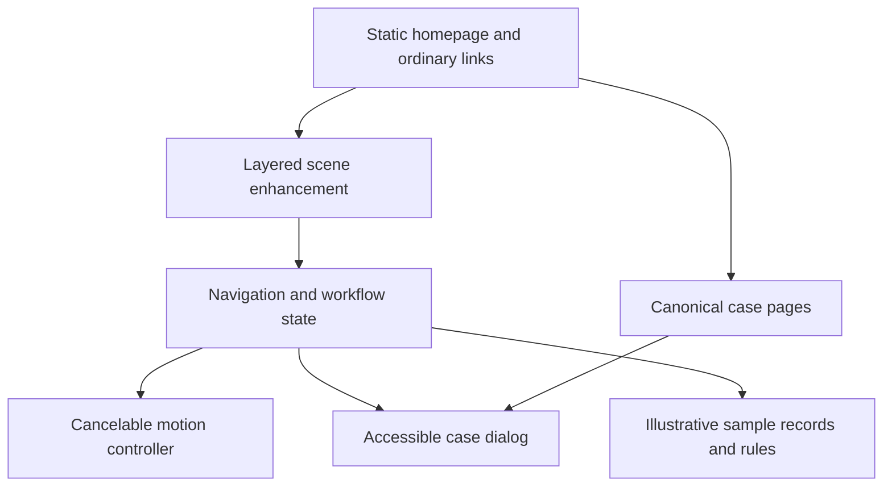
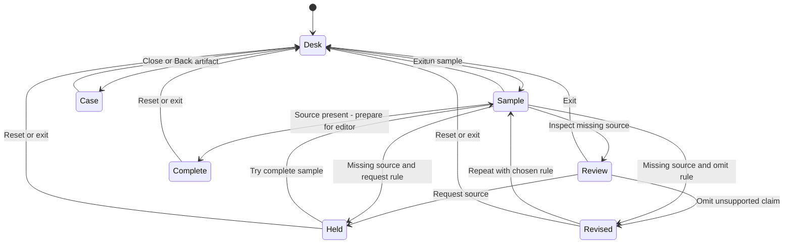

# The Eapen Workshop - Plan

## Goal Capsule

**Objective:** Visitors remember Justus Eapen for making complex work understandable, trust his ability to build useful AI systems, and can choose an appropriate engagement.

**Means:** An editorial workbench with one inspectable publishing workflow and authentic project evidence, built as progressive enhancement (KTD1–KTD4).

**Authority:** The user's latest direction overrides this proposal. The [approved positioning](../strategy/2026-06-23-value-ladder-positioning.md) governs audience, offer hierarchy, and prices. This document proposes the new experience; it does not record approval of its creative direction.

**Execution profile:** Build a polished vertical slice before extending the experience. The prototype gate in the Verification Contract controls that extension. Asset collection and factual review can proceed alongside the slice.

**Boundary:** This planning pass changes documentation only. Future implementation should produce a reviewable preview and PR; publishing follows the user's instructions at that time. The implementer owns integration, verification, and removal of discarded experiments.

---

## Product Contract

### Summary

Make the site feel like spending two minutes beside an unusually good engineer.
A warm pool of light falls across a dark work surface. A submission, an annotated workflow, and a notebook invite inspection. The visitor follows a story through a small editorial system, changes one decision, and sees exactly why the system pauses for a person. Physical objects then open factual stories about Justus's work.

The signature moment is **making one human decision and watching it become a visible rule**. The transformation gives the page its spectacle and its argument. Working title: **The Eapen Workshop**. It describes the creative concept, not a new product or company name.

### Problem Frame

The refreshed site is clear, personal, fast, and commercially usable. It still describes expertise primarily through text and credentials. Its largest evidence gap is an in-depth case study with a clear account of Justus's contribution. Another decorative hero would leave that gap intact.

The opportunity is to let visitors experience his way of thinking. Media and publishing provide a concrete setting for the approved positioning: building automation for small teams while retaining human judgment where it matters.

### What the References Teach

| Reference | Observed in the supplied video | Principle to adopt |
| --- | --- | --- |
| [Daniel Ch's motion film](https://x.com/chddaniel/status/2095775049475313943/video/1) | Around 0:08, oversized “DESIGN” typography with selection handles; around 0:25, a pulled-back team-chat interface; around 0:40, typography again fills the frame. Mint, pale surfaces, tilted close-ups, and changes of scale create a directed product narrative. | Give movement a subject and a destination. Keep one object or idea continuous through a transition. Compose a few exceptional moments with editorial pacing. |
| [Rohan Nuttall's interactive photograph](https://x.com/rohancalum/status/2097009625627500814/video/1) | Around 0:02, a book lifts from a photographed tabletop; around 0:05, the photograph dims behind an enlarged cover and editorial details for *Soft-Tech*. | Make tangible objects into invitations. Let curiosity reveal deeper content while preserving the original context. |

These are observations from playback, not inspections of the examples' source code. Daniel's production-time claim is the author's report and is not a delivery estimate for this project.

### Creative Direction

Retain the charcoal, cream, warm gold, and editorial typography already associated with the site. Add paper fibers, graphite annotations, brushed metal, directional light, and believable contact shadows. The atmosphere is a working studio: precise, warm, and inhabited.

Keep the current clear headline, “Less busywork. More room to build,” for the first slice. Put Justus's name, approved portrait, audience, and two immediate paths beside the scene: **Explore the work** and **Train your team**. Display the training price in that direct path. Exploration never controls access to the offer.

Use a pen annotation as a recurring visual signature: it marks the part of a system that needs judgment. This draws on Justus's established personal identity without inventing a mascot. Its most important line is simple: **“This part needs a person.”**

Objects have subtle lift, consistent perspective, and separate shadows. Their labels are real text. Opening an object brings its details forward into a spacious editorial page. The camera language consists of shallow shifts and close-up-to-overview transitions; page scrolling remains ordinary.

On mobile, art-direct a vertical sequence of generously sized artifacts with adjacent labels. A person's hand should be able to open a document and inspect the decision comfortably. Desktop spatial composition is adapted rather than squeezed into the phone.

### First Visit Storyboard

The times below describe an optional visitor-paced path, not a mandatory timed intro.

| Beat | What the visitor sees or does | What it establishes |
| --- | --- | --- |
| 0–4 seconds | Reads the promise and sees Justus beside the settled workbench. Training and contact are available. | A real person, a clear audience, and a practical offer. |
| 4–9 seconds | Selects **Run a sample workflow**. One editorial submission comes forward. | A concrete invitation requiring one action. |
| 9–15 seconds | The same document becomes a structured brief. A source citation is missing, so a review card interrupts the route. | The system has boundaries and explains them. |
| 15–22 seconds | Chooses **Request a source** or **Omit the unsupported claim**. A gold annotation connects the choice to an explicit rule. | Human judgment becomes an inspectable process. |
| 22–30 seconds | The view widens to show the resulting route: a held submission or a revised brief prepared for an editor. **Inspect the rule** and **Learn to build this** are available. | Technical credibility connects directly to training. |
| Afterward | Opens real project evidence or continues to training, builds, essays, and contact. | The demonstration has factual support and a commercial destination. |

The chosen rule applies to repeated runs of the fictional missing-source example until reset. A second sample with complete sourcing demonstrates the normal route to editor review. Nothing is published. **Inspect the rule** expands an inline explanation beside the document; it does not open another modal. The visitor can compare outcomes and reset without entering personal information.

### Portfolio and Evidence

Below the signature workflow, a compact collection of artifacts becomes the portfolio. Each object needs a factual reason to be there.

| Artifact | Story it opens | Evidence required before publication |
| --- | --- | --- |
| A local inference machine or component | 1T Home: building local AI infrastructure | Owned/public image, exact personal role, one architectural decision, and an inspectable artifact. |
| A workflow sheet | TradeCraft: adapting software to trades | Public product material and precise attribution; no invented customer savings. |
| A Pavlok device | Connecting software, hardware, and a growing team | Approved/public product imagery and a factual account of Justus's responsibilities. |
| An annotated policy diagram | Experience building systems under scrutiny | A clearly labeled reconstruction using publishable knowledge; no confidential interfaces or production records. |
| A microphone or transcript excerpt | Teaching through Elixir Wizards | A verified public episode and attributable excerpt, with transcript access and optional playback. |

Launch with three substantial stories, prioritizing 1T Home, TradeCraft, and Pavlok where suitable evidence is available. Trust-and-safety experience and teaching remain visible in the broader biography. Expand an artifact into a separate case page only when it has enough supported substance.

Each case opens with **the problem, Justus's role, and what he built**. Continue with the important tradeoff, a failure mode or limitation, and verifiable evidence. An honestly explained design decision is useful proof when approved outcome metrics do not exist.

The site distinguishes **illustrative demonstration**, **reconstructed diagram**, and **actual project artifact** beside the relevant material. Generated scenery may establish atmosphere; it cannot stand in for historical evidence. Keep the approved headshot. Actual notes, hardware photography, and an authentic voice excerpt add more personality than another portrait-generation pass.

### Requirements

**Clarity and commercial continuity**

- R1. Visitors can identify Justus, the AI automation/training offer, and the media/publishing audience before interacting with the scene.
- R2. Training remains the lead offer at $2,500/seat, followed by buildouts from $25,000; the $750 planned playbook retains an interest action until availability is established.
- R3. Existing essay URLs, booking destination, email alternative, and a direct route to every offer remain available.

**Experience and evidence**

- R4. One user-initiated workflow demonstrates a consequential review decision using visibly labeled fictional examples and inspectable rules.
- R5. Project objects open factual evidence that identifies Justus's contribution and the provenance of the displayed material.
- R6. The scene supports inspection, immediate exit, repeat, and reset without requesting personal data or uploads, or implying that a model is running live.

**Access and resilience**

- R7. Keyboard, touch, screen-reader, reduced-motion, and JavaScript-disabled visitors can reach the same substantive content and engagement paths.
- R8. Direct case URLs, ordinary link behavior, browser Back/Forward, and failed asset requests preserve usable navigation.
- R9. Motion yields to user navigation, stops when hidden or offscreen, and changes immediately when reduced-motion preferences change.

### Product Decisions

**Preserve the approved commercial position.** The June strategy is established authority; this proposal concerns how visitors experience that position. Governs R1–R3.

**Use one consequential interaction as the centerpiece.** A visitor should remember the decision they made and the engineer who explained it. Governs R4, R6.

**Make the portfolio support the demonstration.** The illustrative workflow explains the method; attributed case evidence establishes experience. Governs R4–R5.

### Success Criteria

Recruit five people resembling the intended buyers for a formative prototype test. This is directional research, not statistical evidence of conversion lift.

- At least four identify the audience and training offer after ten seconds without exploring.
- At least four can explain how their selected policy changes the sample's outcome and name one specific reason to trust Justus after exploring.
- No participant mistakes the illustrative workflow for an available SaaS product or historical client result.
- Ask an unprompted recall question the following day; at least three should remember Justus and the human-review idea. Treat this as a learning target, not a prerequisite that stalls all implementation.

After release, evaluate qualified training inquiries and the specificity of workflows brought to calls. Record a baseline before launch if measurement is available. A booking-link click is a click, not a completed booking. Do not claim improvement from time-on-page or a small, uncontrolled sample.

### Scope Boundaries

The first release contains one main scene, one deterministic workflow, three evidence-led case pages, revised offer transitions, and the existing writing/contact material. A short guided replay uses the same scene and assets; it is not a separate film production.

### Deferred to Follow-Up Work

Additional workflow scenarios, a produced documentary case film, an expanded audio archive, and a personalized engagement brief can follow observed demand. A chatbot, user accounts, arbitrary document uploads, checkout, a navigable 3D world, and a new hosting platform have no role in this proposal.

---

## Planning Contract

### Key Technical Decisions

- KTD1. **Keep static delivery and separate the growing code.** Extract CSS and native JavaScript modules from `index.html`. Retain nginx, Coolify, and Hetzner. A bundler is unnecessary for the proposed dependency-free runtime; test tooling may use a development-only package manifest.
- KTD2. **Use layered photography, semantic HTML, and SVG.** Shallow CSS perspective provides object depth. HTML owns labels and content; SVG owns annotations. Animate transforms and opacity, including separate shadow layers. This fits the [browser animation guidance](https://web.dev/articles/animations-guide) and avoids the flattening traps documented for [transform-style](https://developer.mozilla.org/en-US/docs/Web/CSS/Reference/Properties/transform-style).
- KTD3. **Separate state from choreography.** A small [Web Animations API](https://developer.mozilla.org/en-US/docs/Web/API/Web_Animations_API/Using_the_Web_Animations_API) controller may animate transitions, but completing an animation never controls whether navigation or content works. Cancellation settles the latest requested state and handles rejected animation promises. Optional View Transitions remain feature-detected enhancements.
- KTD4. **Keep case pages canonical.** Ordinary links lead to static `/work/*.html` pages. After a successful same-origin load, enhancement may display the page's article in a native dialog and update history. Failed loading follows the ordinary link. Use root-relative internal links and asset paths so article content works in either context. Use the [History API](https://developer.mozilla.org/en-US/docs/Web/API/History_API/Working_with_the_History_API) and [native dialog behaviors](https://www.w3.org/WAI/WCAG22/Techniques/html/H102.html); do not maintain a second copy of case prose in JSON.
- KTD5. **Keep the rehearsal deterministic and inspectable.** Two fixed samples and a visitor-selected missing-source policy drive the workflow. Requesting a source holds the submission; omitting the unsupported claim shows a marked revision prepared for editor review. The chosen policy persists only within the current rehearsal and reset clears it. Human choices do not retrain a model or modify a live process. Publish a static explanation of both branches for visitors without JavaScript.
- KTD6. **Treat asset packaging as part of the feature.** `Dockerfile` currently copies an explicit allowlist. Extend it for each new production directory/file type, retaining exclusions for source art, documents, private material, and test tooling. Verify the built container, not only a repository-wide development server.

### High-Level Technical Design

The homepage and standalone articles contain all meaningful content. Scene behavior progressively enhances the ordinary links and sample explanation.

Navigation and workflow states remain valid with animation disabled. A navigation action cancels choreography; a stale load cannot replace a newer selection.

For enhanced case navigation, record the invoking link and scroll position. Back restores the preceding view; Forward restores the selected case. A refreshed case URL serves its standalone page with a **Back to work** link. Modified clicks and new-tab commands retain native behavior. The case dialog includes a visible Close control, Escape handling, appropriate initial focus, and focus restoration.

While a case loads, show **Opening [project name]…** beside the activated artifact and announce it once through a polite status region. Keep the page usable and offer **Open page directly**. Repeated activation of the pending target reuses that request; selecting another target cancels the first. A failed or malformed response, or a three-second timeout, follows the ordinary page link for the latest active selection. Do not open an empty dialog or add a history entry while loading.

### Asset and Motion Production

Create a shot list before creating assets: one clean surface plate, each object isolated under consistent light, separate contact shadows, and close-up crops sufficient for the intended reveal. Compose desktop and mobile together. Keep sourced text out of raster images wherever it needs to be read.

The current repository has a portrait and branding assets but no work-object photography. Start the slice with a newly authored illustrative paper document and workflow diagram. For portfolio objects, use verified public or owned assets. If a suitable photograph cannot be obtained, use a clearly identified diagram in the same composition; never fabricate an allegedly personal belonging or historical screenshot.

Review pale cutout halos, duplicate baked shadows, texture scale, soft macro crops, and inconsistent perspective at the maximum displayed size. Keep source images and provenance notes outside the production allowlist.

Use Astra Ultra for storyboard alternatives, composition critique, motion continuity, interaction implementation, accessibility reasoning, and recorded-output review. Image generation can assist with scenic plates and illustrative material. Keep a single art direction across those passes. The opportunity is iteration to a high standard, not a promise of one-shot production.

### Alternatives and Escalation

The evidence-table concept has strong personality but can become a scavenger hunt. The living-essay concept has excellent clarity but a quieter signature. A broadcast desk draws on real podcast experience but could overemphasize hosting. The proposed workshop incorporates tangible evidence while making the editorial decision its central event.

A full WebGL scene is an architectural alternative only if the approved choreography requires changing silhouettes, substantial camera orbit, or underside reveals. First test those needs in the vertical slice. If they become essential, revise this plan before adding Three.js, define its asset/runtime budget, and keep all navigation and content in HTML. The library supports [rendering on demand](https://threejs.org/manual/en/rendering-on-demand.html), but that does not make 3D necessary for a shallow object lift.

### Deferred Implementation Questions

Final photographs, exact easing curves, mobile crop positions, and the strongest publishable third case are execution-time choices with defined fallbacks above. Verified metrics and a voice excerpt enrich the result but are not assumed prerequisites. Playbook checkout remains contingent on real product readiness. None of these unknowns authorizes new public claims.

---

## Implementation Units

### U1. Establish the evidence and art direction

**Goal:** Make the creative direction and all planned claims concrete before investing in animation.

**Requirements:** R1, R2, R4, R5. **Dependencies:** None.

**Files:** Create `docs/design/eapen-workshop-art-direction.md`, `docs/design/eapen-workshop-evidence.md`, and source assets under `design/workshop/`.

**Approach:** Produce desktop/mobile still compositions, a six-beat storyboard, a provenance ledger, and three concise case outlines. Check project roles against the current site and available sources. Identify which objects are authentic evidence and which are illustrative.

**Test expectation:** No automated tests for planning or source art. Review legibility, factual support, consistent lighting, and the ordinary offer path.

**Verification:** The static storyboard explains the experience without motion; every planned factual claim has a source or is removed.

### U2. Prove one finished interaction

**Goal:** Establish whether the tactile reveal feels exceptional and communicates the intended idea.

**Requirements:** R4, R6–R9. **Dependencies:** U1.

**Files:** Create an isolated preview under `prototypes/workshop/`, with `tests/workshop-slice.spec.js` and development-only test configuration if required.

**Approach:** Build one final-quality paper artifact, one review decision, one reveal, and one mobile composition per KTD2, KTD3, KTD5. Test shallow depth before considering the architectural escalation. Keep the deployed homepage untouched during this unit.

**Test scenarios:**

- Keyboard and a single touch activation reach the same decision and explanatory content.
- Repeated activation and exit during motion settle into the most recently requested view.
- Reduced motion, including a runtime preference change, shows the settled state without losing content.
- An unavailable image leaves a labeled, actionable document.

**Verification:** Pass the prototype gate before expanding the scene. Record the chosen result and remove abandoned variants after integration.

### U3. Publish the factual portfolio foundation

**Goal:** Give every principal artifact a substantial and independently accessible destination.

**Requirements:** R3, R5, R7, R8. **Dependencies:** U1.

**Files:** Create `work/1t-home.html`, `work/tradecraft.html`, `work/pavlok.html`, `assets/workshop/`, `styles/site.css`, and `tests/workshop-navigation.spec.js`; modify `index.html` and `Dockerfile`.

**Approach:** Write and lay out the canonical articles per KTD4. If a proposed case cannot be substantiated, substitute another verified case and update its paths consistently. Establish shared static styling and package the public assets per KTD6.

**Test scenarios:**

- Each direct URL loads a complete article with role, evidence, and an offer/contact path.
- JavaScript disabled and failed imagery preserve readable articles and functional links.
- Existing essays and offer anchors remain reachable from the revised homepage.

**Verification:** Review every factual claim, attribution, accessible image description, and direct route in the production container.

### U4. Integrate the workshop and rehearsal

**Goal:** Connect the proven interaction to the portfolio and the service journey.

**Requirements:** R1–R9. **Dependencies:** U2, U3.

**Files:** Modify `index.html`, `styles/site.css`, `Dockerfile`; create `scripts/workshop-scene.js`, `scripts/workshop-motion.js`, `scripts/workshop-navigation.js`, `scripts/workshop-demo.js`, and `tests/workshop-experience.spec.js`; extend `tests/workshop-navigation.spec.js`.

**Approach:** Implement KTD1–KTD6. Reuse the prototype's chosen assets and behavior. Integrate canonical articles with the enhanced dialog. Replace the ambient Game of Life treatment with the workshop's single visual language. Connect the demonstration to the lead training offer.

**Test scenarios:**

- Each missing-source policy produces its documented outcome, repeated runs preserve the selected policy, and reset clears it.
- The complete sample reaches editor review without implying publication; the inline rule explanation is available to keyboard and screen-reader users.
- Back/Forward, direct refresh, Close, Escape, and new-tab navigation follow KTD4.
- An earlier case fetch finishing after a newer selection cannot replace the newer content.
- A failed case fetch follows its normal page link without leaving an empty modal.
- Pending case loading shows its status immediately; duplicate activation reuses the request; timeout or malformed content follows the active case link.
- Hidden/offscreen state and reduced motion stop animation while navigation remains usable.
- Keyboard focus, screen-reader announcements, and mobile tapping reach the same outcomes.

**Verification:** The full visitor journey works with enhancement enabled and disabled; no demonstration result implies a real deployment or client outcome.

### U5. Finish, measure, and package

**Goal:** Produce a coherent, verified release candidate.

**Requirements:** R1–R9. **Dependencies:** U4.

**Files:** Update `assets/social-card.png`, `sitemap.xml`, `robots.txt` if needed, `Dockerfile`, `.dockerignore`, `CLAUDE.md`; create `docs/audits/eapen-workshop-release.md`; extend the existing planned browser tests where findings warrant it.

**Approach:** Apply the Verification Contract to the actual container build. Review still frames and motion recordings separately. Document baseline/measurement limits and any real-device coverage gaps. Remove the prototype directory, unused exports, and abandoned implementations once their decisions are captured.

**Test scenarios:**

- Every referenced public asset, module, stylesheet, page, and crawler file exists in the production container.
- The container excludes design sources, internal docs, and test tooling.
- The current viewport matrix and slow/failing resource paths preserve readable content and contact actions.

**Verification:** Produce the reviewed preview, accurate PR description, validation evidence, and known limitations. Deployment is a distinct final action under the user's current authorization.

---

## Verification Contract

**Prototype gate:** A final-quality artifact/reveal must survive close inspection, keyboard/touch operation, rapid cancellation, and the narrow composition. Run the immediate formative tests in Success Criteria. If clarity or product comprehension fails, revise the slice before expanding it. If the visual depth requires unsupported camera movement, settle the architecture before integration.

| Gate | Required evidence |
| --- | --- |
| Truthfulness | Provenance ledger matches displayed claims and artifacts; fictional sample labels remain visible at the point of interpretation. |
| Content/access | Ordinary links and standalone articles work without JavaScript; VoiceOver, keyboard focus, touch, Escape, and 200% zoom are manually checked. Automated accessibility checks supplement that inspection. |
| Browser and responsive behavior | Current Safari, Chrome, and Firefox; widths 320, 390, 620, 768, 900, 1024, and 1440+; real iOS/Android hardware where available. Name unavailable coverage. |
| State resilience | Tests in U2–U4 cover canceled/repeated actions, stale fetches, failures, history, reset, hidden tabs, and runtime reduced motion. The repo currently has no test runner; establish a small development-only browser harness. |
| Transfer budget | Project targets: initial mobile transfer at most 1 MB including fonts and first-party compressed JavaScript at most 40 KB. Load detailed case imagery and optional media on intent. Reserve image dimensions. |
| Performance | Target LCP at most 2.5 s, INP at most 200 ms, and CLS at most 0.1, following [Core Web Vitals](https://web.dev/articles/vitals). Capture lab traces on representative mobile conditions; field claims require real-user data. |
| Motion quality | Aim for a smooth 60 Hz interaction on the representative test device; inspect frame traces and recordings. Fix sustained jank by simplifying effects. A still fallback stays complete. |
| Production packaging | Validate the nginx container's actual contents and HTTP responses. A successful local file server is insufficient for the selective Docker allowlist. |

These budgets are proposed project constraints. They are not measured results for the future implementation. No existing build or tests were run during this planning pass.

---

## Definition of Done

The release candidate passes the Verification Contract, has one coherent signature experience, and supports a complete static path through three factual case stories and the approved offers. All shipping images and claims have recorded provenance. Desktop and mobile feel composed for their respective formats.

The preview demonstrates the user-paced narrative and its instant reduced-motion equivalent. Real claims remain distinguishable from the illustrative workflow. The existing essay and contact routes work. The PR describes what changed, evidence collected, and remaining coverage limits. Unused prototypes, duplicate content, and discarded visual treatments are removed; retained source art is excluded from production.
